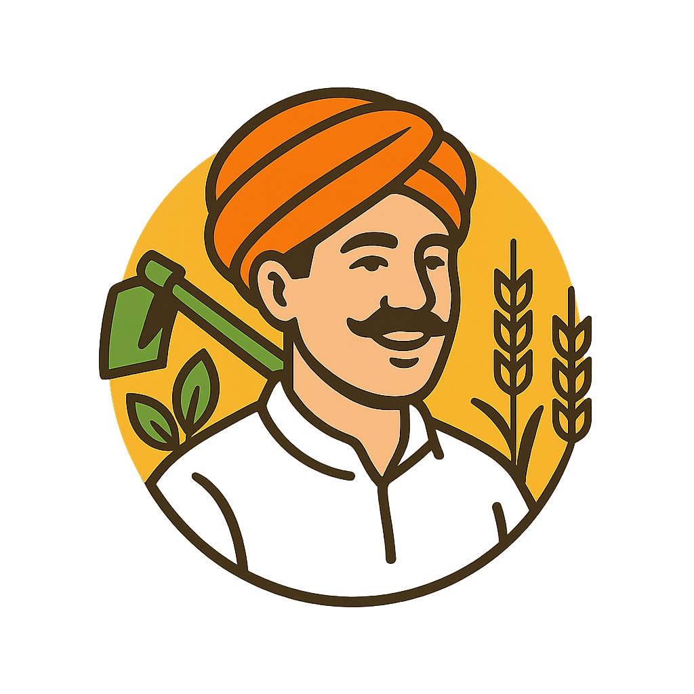
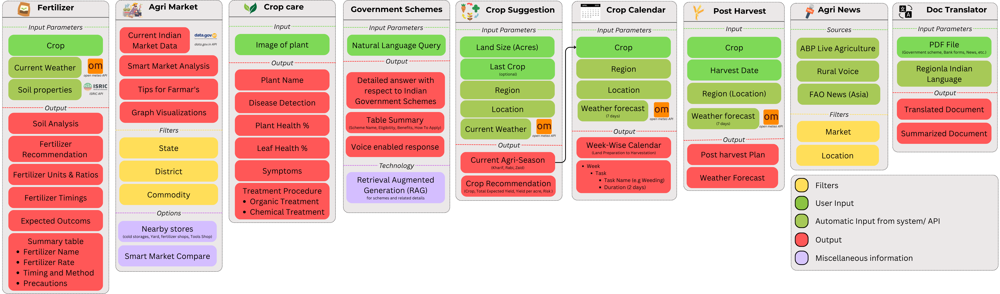

<table align="center">
    <tr>
        <td></td>
        <td><h1>Krishi Setu - Empowering Indian Farmers Through AI & LLMs</h1></td>
    </tr>
</table>

Krishi Setu is a multilingual, AI-powered mobile application designed to assist Indian farmers with crop advisory, market intelligence, government scheme access, and post-harvest support. It leverages the power of large language models (LLMs), voice interfaces, and computer vision to bridge the digital divide in Indian agriculture.

## Problem Statement

Despite the availability of smartphones and government schemes, Indian farmers—especially small and marginal ones—face challenges in accessing timely, relevant, and localized agricultural information. Language barriers, literacy gaps, and digital unfamiliarity prevent them from benefiting from existing solutions.

**Theme:** Open Innovation
**Domain:** Agriculture
**Category:** Software
**Team Name:** Neurons

## Our Solution: Krishi Setu

An AI-first advisory platform that:

- Offers voice-enabled, multilingual access to personalized agricultural advice.
- Integrates LLMs (via Groq) and RAG pipelines for intelligent, real-time responses.
- Provides market intelligence, government scheme discovery, crop calendars, and disease detection through images.
- Summarizes documents and offers post-harvest support insights.

## Key Features

- 🧠 **Agentic RAG Chatbot**: Personalized advisory using LangChain and Groq LLMs.
- 🎙️ **Voice Interaction**: Natural, intuitive voice navigation in regional languages.
- 🌾 **Smart Farming Tools**:

  - Image-based disease detection
  - Personalized crop calendars
  - Market price prediction and mapping

- 🏛️ **Scheme Navigator**: Simplifies access to complex government schemes.
- 📄 **Document Summarizer**: AI-based summarization of official agri-documents.

## Features list 

## Tech Stack

| Category      | Tools/Technologies                             |
| ------------- | ---------------------------------------------- |
| **Frontend**  | React Native, TailwindCSS                      |
| **Backend**   | Node.js, Flask, Python                         |
| **AI & LLMs** | Groq, LangChain                                |
| **Database**  | MongoDB, ChromaDB (Vector DB)                  |
| **APIs**      | Open Meteo API, Data.gov APIs, ISRIC Soil Data |
| **Auth**      | OAuth 2.0                                      |

## Impact

- **Audience**: Small & marginal farmers (\~86% of India’s farming population)
- **Outcomes**:

  - Increased yield and income via smarter decisions
  - Reduced middleman dependency
  - Higher adoption of tech in rural Bharat

### 📈 Benefits

- **Social**: Inclusive access to crucial information
- **Economic**: Better prices, less waste
- **Environmental**: Informed, sustainable practices

## 📚 Research & References

- Digital usage by farmers: [QQRI, 2022](https://qqri.com/2022/11/02/digital-usage-trends-amongst-indian-farmers/)
- Agritech adoption statistics: [Times of India, 2022](https://timesofindia.indiatimes.com/blogs/voices/are-farmers-really-harvesting-the-power-of-tech-the-real-tech-penetration-that-has-touched-bharat/)
- Smallholder challenges: [World Economic Forum, 2021](https://www.weforum.org/stories/2021/06/agri-tech-innovation-can-improve-value-capture-and-transform-ecosystem-for-india-s-small-farmers/)
- Workforce stats: [Statista](https://www.statista.com/chart/32259/indias-workforce/)

📄 **Full Documentation**: [Click here](https://docs.google.com/document/d/1__oHD9MiGU6J3u8ourg6Wyi7kaoEhabBT_3RpOP5_RU/edit?tab=t.0)

📄 **Presentation**: [Click here](https://docs.google.com/presentation/d/13Km54XeRY22BMwDwPikW5dWK7EgTp-_XC8qnFXp0X6M/edit?usp=sharing)

---

> © 2025 Neurons – AGTechathon Team | Built with ❤️ to empower India's farmers.
